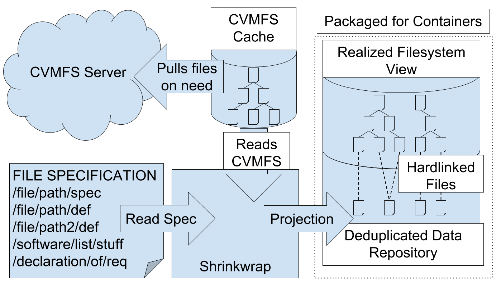

Architecture
============

The CernVM-FS Shrinkwrap utility exploits the design of CVMFS to deduplicate
data and capture specific repository versions offered by CVMFS.
Shrinkwrap is built using the CVMFS client library `libcvmfs`
to allow user-level access, without requiring FUSE,
enabling use on a number of restricted sites.
Using the CVMFS client library allows Shrinkwrap to use CVMFS's metadata catalogs,
providing lightweight queries and access to parts of the 
repository without requiring all file contents to be transferred.
In addition to lightweight file queries, the CMVFS
client library provides a range of CVMFS features
such as full repository histories and web proxy servers for managing data access at scale.

When creating a projection,
Shrinkwrap makes a connection to the CVMFS servers
and constructs a traversal tree from the provided specification.
The file specification contains a list of files and patterns
that are expected in the final image.
File specifications are discussed later in
[Specifications](spec.md).
On the first pass, files in the specification are read from
CVMFS and written to a local data store.
The contents are stored in a data directory using
the same content addressed structure as CVMFS.
The file tree entry is then populated with hard links into
the data store.
If run again in the future, Shrinkwrap uses the same traversal
mechanisms, but only pulls 
data and updates links as needed to reflect new changes.
This includes tracking changes to the tree structure and
the content addressed data,
and allows for quick verification and update cycles
that limit redundant data access.
Shrinkwrap writes the local projection to a POSIX filesystem,
allowing for a wide variety of methods of packaging and
distribution.
Using this design, multiple projections and 
different repositories can share the same data directory,
further eliminating duplication.

The overall design of Shrinkwrap.

CernVM-FS Shrinkwrap Layout
===========================

The structure used in the Shrinkwrap output mirrors that used internally
by CernVM-FS. The visible files are hardlinked to a hidden data directory.
By default ``cvmfs_shrinkwrap`` builds in a base directory (``/tmp/cvmfs``)
where a directory exists for each repository and a ``.data`` directory
containing the content-addressed files for deduplication. 

| **File Path** | **Description** |
| --- | --- |
|``/tmp/cvmfs`` |  **Default base directory** Single mount point that can be used to package repositories, containing both the directory tree and the data directory. |
| ``<base>/<fqrn>`` | **Repository file tree** Directory containing the visible structure and file names for a repository. |
| ``<base>/.data`` | **File storage location for repositories** Content-addressed files in a hidden directory. |
| ``<base>/.provenance`` | **Storage location for provenance** Hidden directory that stores the provenance information, including `libcvmfs` configurations and specification files. |

Notes
=====

When using Shrinkwrap, some of the features exploited in CVMFS with FUSE may
behave differently. The most notable are the *magic* symlinks that
resolve from environment variables, of which a common example is resolve which
Operating System is in use. When using Shrinkwrap, these *magic* variables are
resolved at image creation, which requires either using a consistent set of resolved
variables or resolving the possible variations in the file specification.

As a result of Shrinkwrap emulating the expected behavior of CVMFS,
the data store and filesystem tree need to be on the same filesystem.
Hard links are used to limit redundant data when connecting the files in the
visible file tree to those in the data store. 
Using hard links requires both files be on the same disk, which is often the case
for packaging images.
